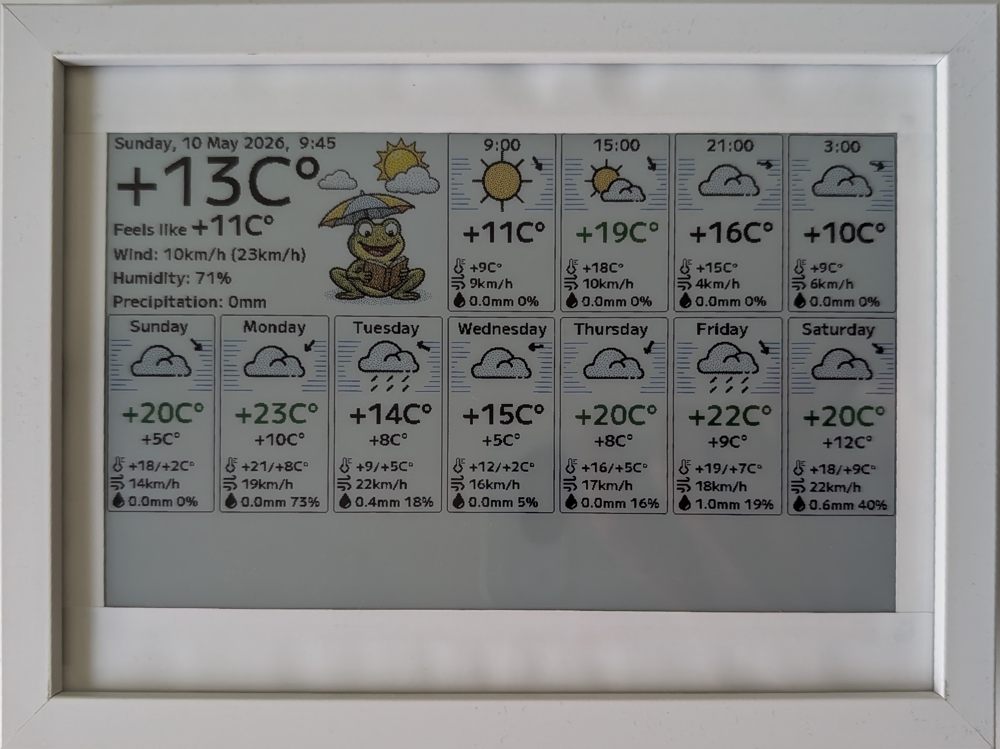
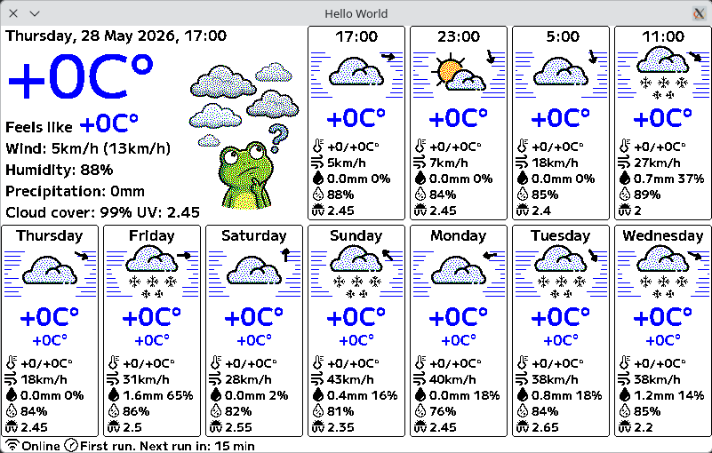

# epd-frame-rs-2

Firmware for the **Pimoroni Inky Impression 7.4" Electronic Paper Display** (6-color E-Ink) powered by **Raspberry Pi Pico 2W**.

## Overview

This project is a Rust-based firmware designed to display weather information on a Pimoroni Inky Impression 7.4" EPD. 
The display supports 6 colors and communicates with a Raspberry Pi Pico 2W controller.

## AI Slop
The following parts of the project were generated by AI Agent:
- Configuration HTTP server with HTML UI
- Frogs :)
- Wind direction arrows
- convert_to_e6spectra.py
- This readme

## Current blocker
I have no luck with powering down the RP2350 using the POWMAN. 
It works only when the controller is started from the Debugging interface.

## Screenshots

### EPD Display

### Simulator

## Simulator
The simulator can render the result to the display and provide access to the HTTP configuration server.
It requires a TAP interface to be configured.
There is a `create_tap.sh` script to create the TAP interface that may work for you.

## Images format
The firmware uses a custom image format: `.e6spectra`.
It's just an array of nibbles with a simple header and transparent background skipping.
The .bmp image can be converted to this format using `convert_to_e6spectra.py`.
To reduce image colors to 6 using dithering, you can use the `remap_images_to_e6_colors.sh` script.

## Features

- ✅ **6-Color E-Ink Display**: Full support for the Pimoroni Inky Impression 7.4" display
- ✅ **Weather Display**: Fetches and displays current weather information
- ✅ **Embedded Graphics**: Built with `embedded-graphics` for efficient rendering
- ✅ **Simulator Support**: Test and develop without physical hardware
- ⚠️ **Sleep Schedule**: Work in progress - sleep scheduling functionality needs further development
- 🌐 **WiFi Connectivity**: Uses Raspberry Pi Pico 2W's wireless capabilities
